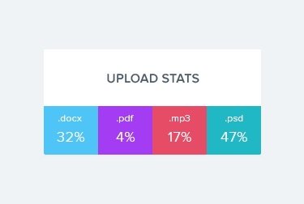

**Читать на других языках: [Русский](README.md), [Українська](README.ua.md).**

# Критерії прийому

- Створено репозиторій `goit-react-hw-01-components`
- Компоненти всіх завдань рендеряться на одній сторінці, всередині загального
  контейнера - кореневого компонента `<App>`
- При здачі домашньої роботи є два посилання: на вихідні файли і робочу сторінку
  на `GitHub pages`
- При відвідуванні робочої сторінки (GitHub pages) завдання, в консолі немає
  помилок і попереджень
- Для кожного компонента є окрема папка з файлом React-компонента і файлом
  стилів
- Для компонентів описані `propTypes`, і де необхідно, `defaultProps`
- Все що компонент очікує у вигляді пропсів, передається йому при виклику
- Імена компонентів зрозумілі, описові
- JS-код ччистий і зрозумілий, використовується `Prettier`
- Стилізація робиться тільки `SASS`, `CSS-модулями` або `Styled Components`,
  тому класи в результуючому DOM можуть відрізнятися від прикладів.
- Для стилізації досить позиціонування і розміри наближені до макету.
  Компоненти, в першу чергу, повинні працювати, а вже потім бути красиві,
  виділяй 20% часу на стилізацію і 80% на JS.

# Задания

## Завдання 1

# Профіль соціальної мережі

Необхідно створити компонент `<Profile>`, за допомогою якого ми могли б
відображати інформацію про користувача соціальної мережі. Дані про користувача
лежать в файлі [user.json](./src/components/profile/user.json).


## Опис компонента

Компонент повинен приймати кілька пропсів з інформацією про користувача:

- `name` — ім'я користувача
- `tag` — тег в соціальній мережі без `@`
- `location` — місто і країна
- `avatar` — url на зображення
- `stats` — об'єкт з інформацією про активність

Компонент повинен створювати DOM елемент такої структури.

```html
<div class="profile">
  <div class="description">
    
    <p class="name">Petra Marica</p>
    <p class="tag">@pmarica</p>
    <p class="location">Salvador, Brasil</p>
  </div>

  <ul class="stats">
    <li>
      <span class="label">Followers</span>
      <span class="quantity">1000</span>
    </li>
    <li>
      <span class="label">Views</span>
      <span class="quantity">2000</span>
    </li>
    <li>
      <span class="label">Likes</span>
      <span class="quantity">3000</span>
    </li>
  </ul>
</div>
```

## Приклад використання

```js
import user from 'путь/к/user.json;

<Profile
  name={user.name}
  tag={user.tag}
  location={user.location}
  avatar={user.avatar}
  stats={user.stats}
/>
```

## Завдання 2

# Секція статистики

Створити компонент `<Statistics>`, який би відображав статистику по переданим
пропах. Наприклад завантаження в хмару по типу файлів, відвідування веб-сторінки
користувачами різних країн, фінансові витрати і т. п. Дані про статистику лежать
у файлі [statistical-data.json](./src/components/statistics/statistical-data.json).



## Опис компонента

Компонент повинен приймати два пропи `title` і `stats`, в яких вказується
заголовок і об'єкт статистики.

- `title` - не обов'язковий, і якщо він не переданий, не повинна рендеритися
  розмітка заголовка `<h2>`.
- `stats` - масив об'єктів, що містять інформацію про елементи статистики. Може
  мати довільну кількість елементів.
- Колір фону елемента статистики в оформленні можна пропустити, або створити
  функцію для генерації випадкового кольору.

Компонент повинен створювати DOM елемент такої структури.

```html
<section class="statistics">
  <h2 class="title">Upload stats</h2>

  <ul class="stat-list">
    <li class="item">
      <span class="label">.docx</span>
      <span class="percentage">4%</span>
    </li>
    <li class="item">
      <span class="label">.mp3</span>
      <span class="percentage">14%</span>
    </li>
    <li class="item">
      <span class="label">.pdf</span>
      <span class="percentage">41%</span>
    </li>
    <li class="item">
      <span class="label">.mp4</span>
      <span class="percentage">12%</span>
    </li>
  </ul>
</section>
```

## Приклад використання

```js
import statisticalData from "/path/to/statistical-data.json";

ReactDOM.render(
  <Statistics title="Upload stats" stats={statisticalData} />,
  document.getElementById("root")
);
```

## Завдання 3

# Список друзів

Необхідно створити компонент `<FriendList>`, за допомогою якого ми могли б
відображати інформацію про друзів користувача. Інформація про друзів
зберігається в файлі [friends.json](./src/components/friendList/friends.json).


## Опис компонента FriendList

Компонент повинен приймати один проп `friends` - масив об'єктів друзів.

Компонент повинен створювати DOM наступної структури.

```html
<ul class="friend-list">
  <!-- Довільна кількість FriendListItem, в залежності від кількості об'єктів в масиві -->
</ul>
```

## Опис компонента FriendListItem

Компонент повинен приймати кілька пропів:

- `avatar` - посилання на аватар
- `name` - ім'я друга
- `isOnline` - буль, який сигналізує про стан друга, в мережі чи ні.

Залежно від пропа `isOnline`, повинен змінюватися колір фону `span.status`. Це
можна зробити через різний CSS-клас або Styled Components.

Компонент повинен створювати DOM наступної структури.

```html
<li class="item">
  <span class="status"></span>
  
  <p class="name"></p>
</li>
```

## Приклад використання

```js
import friends from "path/to/friends.json";

<FriendList friends={friends} />;
```

## Завдання 4

# Історія транзакцій

Необхідно створити компонент історії транзакцій в особистому кабінеті інтернет
банку.


Дані для списку доступні в форматі JSON в файлі
[transactions.json](./src/components/transaction/transactions.json). Це масив об'єктів, кожен об'єкт описує
одну транзакцію з наступними властивостями:

- `id` — унікальний ідентифікатор транзакції
- `type` — тип транзакції
- `amount` - сума транзакції
- `currency` - тип валюти

## Опис компонента

Необхідно створити компонент `<TransactionHistory>`, який приймає один проп
`items` - масив об'єктів транзакцій з `transactions.json`. компонент створює
розмітку таблиці. Кожна транзакція це рядок таблиці, для прикладу вказана
розмітка двох транзакцій.

```html
<table class="transaction-history">
  <thead>
    <tr>
      <th>Type</th>
      <th>Amount</th>
      <th>Currency</th>
    </tr>
  </thead>

  <tbody>
    <tr>
      <td>Invoice</td>
      <td>125</td>
      <td>USD</td>
    </tr>
    <tr>
      <td>Withdrawal</td>
      <td>85</td>
      <td>USD</td>
    </tr>
  </tbody>
</table>
```

## Приклад використання

```js
import transactions from "path/to/transactions.json";

ReactDOM.render(
  <TransactionHistory items={transactions} />,
  document.getElementById("root")
);
```
